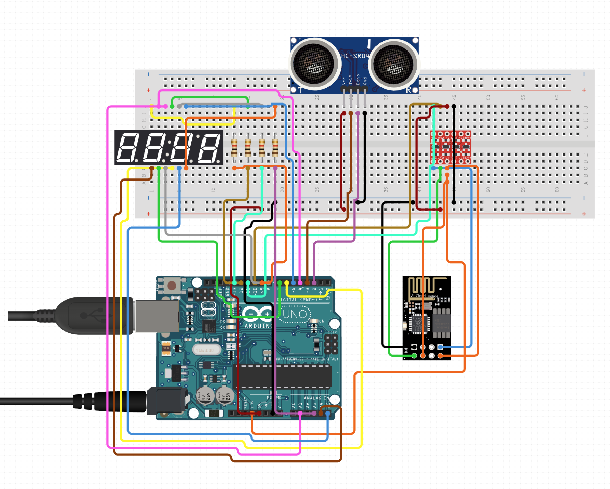

# Water Level Sensor

This project contains the code for using an ultrasonic distance sensor to determine the water level in a tank.

An Arduino Uno reads from the sensor, sends the data to a 4-digit display, and uses an ESP8266 to log the data to a remote ThingsBoard instance hosted on Google Cloud Platform.

The ESP8266 is programmed to handle all the web traffic, receiving wake signal from the Uno and data via serial.

## Hardware

1. Arduino Uno R3
2. WiFi ESP-01 (ESP8266) (with simple breakout board)
3. Ultrasonic Sensor AJ-SR04M
4. Display TM1637
5. Bi-directional Logic Level Controller

## Wiring

